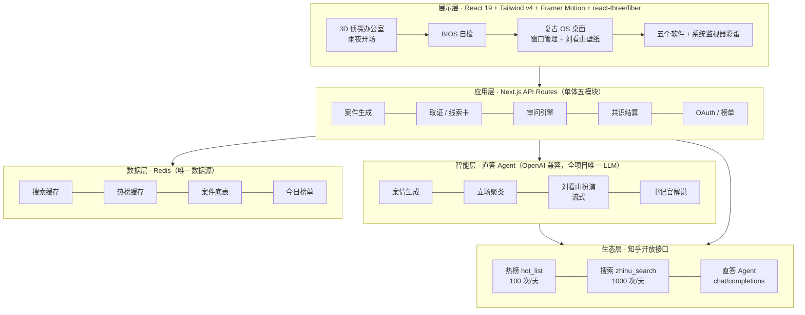
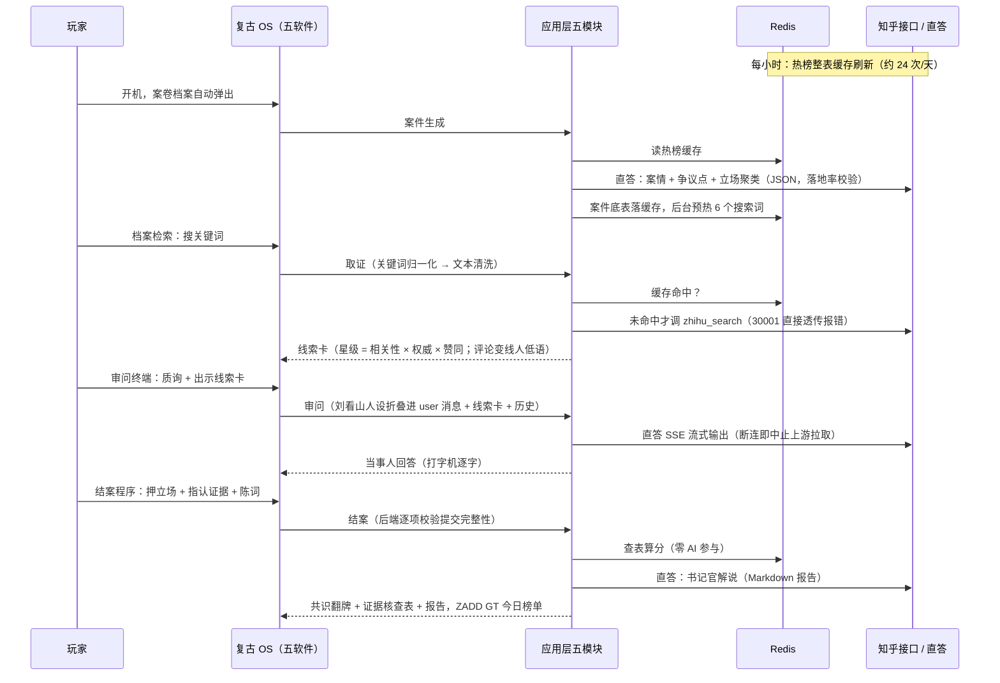

# 🔍 热搜疑云 · Trending Mystery

> **一款离开知乎生态就无法成立的叙事侦探游戏。**
> 每天，知乎热榜自动生成一个全新"案件"——用真实回答当线索，审问一只有据可依的 AI 狐狸，最后对比"社区共识"结案。

**阅读动线**：01 是什么 → 02 怎么玩 → 03 怎么赢 → 04 技术方案 → 05 生态契合 → 06 路线图

---

## 01 · 这是什么

**热搜疑云**是一款由知乎真实热点驱动的每日叙事侦探游戏：内容随热榜每日自动刷新，全球玩家同题破案，每一次取证、质询、结案都建立在知乎站内真实、鲜活的问答之上。

形态一句话：**每日一局的 Wordle × 取证质询的逆转裁判**。浏览器打开即玩，一局 15~30 分钟；次日热榜刷新，全服换同一个新案子。没有下载，没有大世界，没有打怪升级。

而这一切发生的地方，是一台 1990 年代雨夜侦探事务所里的复古电脑 **TM-01**——整个游戏没有页面跳转：从 3D 办公室按下回车开机，BIOS 自检，落进一块 CRT 桌面，四个玩法步骤是桌面上的四个软件，知乎吉祥物**刘看山**在桌面右下角陪你值班，也会坐进审问室当被质询的当事人。

> 创作理念：**把"吃瓜"升级为"破案"。**
> 热点天然具备悬疑叙事的全部要素——未知全貌、多方说法、真假难辨。我们不做内容搬运工，而是把知乎已有的内容资产（热榜、搜索、回答、赞同、创作者等级）重新组织成一套侦探玩法系统，让用户以"侦探"的身份重新走进每一个热点。

---

## 02 · 怎么玩：一台电脑，五个软件

开场是一间 WebGL 侦探事务所：雨夜，闪电穿窗在桌面投下影子，台灯忽明忽暗，墙上挂钟停在 2:47。桌上那台 CRT 就是 TM-01——按下回车，镜头推进屏幕，BIOS 刷过，桌面亮起。玩法循环全部住在电脑里，**零路由跳转**：

```
 1️⃣ 案卷档案 ──► 2️⃣ 档案检索 ──► 3️⃣ 审问终端 ──► 4️⃣ 结案程序 ──► 今日神探榜
       ▲                                                              │
       └────────────────── 次日热榜，全新案件 ◄────────────────────────┘
```

以下跟随玩家小张走一局（虚构案件："某地地铁为何发生追尾事故？"）。

### 软件 01 · 案卷档案 —— 开局领案（看 · 约 2 分钟）

开机后自动弹出，等于今日案件的卷宗封面：

```
┌────────────────────────────────────────────┐
│ 📁 案件编号 #20260910                       │
│ 问题：某地地铁为何发生追尾事故？              │
│                                            │
│ 案情简报（AI 依据高赞回答摘要撰写）：          │
│   昨夜 23 时许，两列车于 3 号线隧道内追尾，    │
│   官方通报指向"信号系统故障"，但多位自称      │
│   内部人士的爆料相互矛盾……                   │
│                                            │
│ 本次需查明 3 个争议点：                      │
│   ① 直接原因是什么？  ② 谁负主责？           │
│   ③ 爆料者的动机？                          │
│                                            │
│ 初始检索词：#信号系统 #调度记录    [开始搜查] │
└────────────────────────────────────────────┘
```

这一步等于考试前发卷子：结案要答哪几道题（争议点）现在就写明，搜资料有了靶子。换榜单位次即换案。

### 软件 02 · 档案检索 —— 搜 + 翻（约 8~15 分钟，分差主要在这里）

搜索框伪装成档案检索终端，背后就是知乎搜索。结果不列网页，而是一张张**线索卡**落进线索墙：

```
┌──────────────────────────────────────────────────────┐
│ 🔍 [ 地铁追尾 辟谣____________ ]  [检索]              │
│──────────────────────────────────────────────────────│
│ 疑点清单                  │ 🗂 线索墙（已收 6 张）     │
│  ① 直接原因               │ ┌─────────┐ ┌─────────┐ │
│  ② 谁负主责               │ │信号系统是│ │我同学是  │ │
│  ③ 爆料动机               │ │主因     │ │调度员…  │ │
│                          │ │⭐⭐⭐⭐⭐ │ │⭐⭐     │ │
│ 建议检索：                │ │👍 2.1万 │ │👍 342   │ │
│  #检修记录 #调度日志      │ │[收入档案袋]│[收入档案袋]│ │
│  #知情人士                │ └─────────┘ └─────────┘ │
└──────────────────────────────────────────────────────┘
```

星级与赞同数都是真实数据。拉开分差的三个操作习惯：

- **换着花样搜**：正着搜（"事故 原因"）、反着搜（"辟谣""质疑"）、换主体搜——只搜一组词的人只看到事件的一面；
- **每个立场都留牌**：哪怕不信"第三方施工责任"，也要留它的线索卡——结案时立场牌全摆出来，得先知道牌桌上有哪些注可押；
- **学会读赞同数**：2 万赞的五星技术帖和 300 赞的匿名小道消息摆在一面墙上，社区压哪边已经写在脸上。**高赞 × 高星 = 主流立场的指纹**（共识权重正是按赞同数加权的）。

每张卡还带**线人低语**——来自精选评论的三句原声（表情符还原成 emoji、HTML 实体解码后再上卡），是社区情绪的直接采样。

### 软件 03 · 审问终端 —— 问 + 拖（约 5~10 分钟）

对话界面，对面坐着的当事人是**刘看山**——知乎家喻户晓的小白狐，热榜世界的原住民，每个案子都"从头围观到尾"，所以每个案子都被侦探请来问话。关键交互：**除了打字质询，还可以把线索卡拖上审问桌"出示"**：

```
┌──────────────────────────────────────────────────────┐
│ 🦊 审问终端 · 当事人：刘看山（本案知情者）             │
│──────────────────────────────────────────────────────│
│ 刘看山：「那晚我就在附近溜达嘛，后门好像有车灯晃…」    │
│                                                      │
│ 你（出示 线索#3《信号系统三年未检修》⭐⭐⭐⭐⭐）：      │
│    监控停摆那两小时你刚才怎么不提？检修单是后补的？     │
│                                                      │
│ 刘看山：「哎哟……确实是有人扒出来检修单日期不对劲，     │
│  帖子当时还上过榜。这就不是我能猜的了，侦探你查内部   │
│  的人呗。」                                          │
│──────────────────────────────────────────────────────│
│ 💬 [ 输入质询…… ]   [🗂 出示线索卡]  [发送]           │
└──────────────────────────────────────────────────────┘
```

问泛问题它就打太极；出示矛盾的卡、追问细节，它才承认破绽、补出新信息——但话锋一转还想把水搅浑。**玩家喂进哪几张卡，决定 AI 能被撬开哪一面**——喂卡本身就是策略。（问他"你是谁"也行——见 §4.7 的直答实测。）

### 软件 04 · 结案程序 —— 押 + 拖（约 3 分钟）

争议点逐个结算：候选结论做成**立场牌**摆开，押一张，再把支持它的线索卡拖下去当证据：

```
┌──────────────────────────────────────────────────────┐
│ ⚖ 结案 · 争议点 ①：直接原因是什么？（1/3）            │
│                                                      │
│   ┌─────────┐  ┌─────────┐  ┌─────────┐             │
│   │ 设备老化 │  │ 调度违规 │  │ 第三方   │ ← 押一张    │
│   │  失修    │  │  操作    │  │ 施工责任 │             │
│   └────┬────┘  └─────────┘  └─────────┘             │
│        └ 指认证据：[线索#3 ⭐5] [线索#7 ⭐4]           │
│                                                      │
│ 结案陈词（可选）：[ 我认为……                    ]     │
│                                [ ⚖ 提交结案 ]        │
└──────────────────────────────────────────────────────┘
```

每个争议点都必须表态才能提交（前后端双重校验）；一个证据不指认就提交，会先弹"确认裸奔提交"警告——尊重玩家，但把代价说清楚。

### 尾声 · 共识翻牌 + 书记官报告（约 1 分钟）

分数算完（见 §04 结案管线），立场牌**集体翻面**亮出社区权重——"设备老化"背后是 45% 的高赞主流，"第三方施工"只有 20%。随报告一起交付的还有**证据核查表**：你指认的每一张卡逐张亮出真实立场归属与星级，判分依据完全透明，不接受黑箱。书记官（LLM）只解说数据，侦探风结案报告以打字机逐字吐出，成绩进**今日神探榜**（重玩只升不降，榜上永远是你最好的一局）。

---

## 03 · 怎么赢

胜利不是"猜中真相"，而是**高分结案**：

```
总分 = 共识吻合度 × 50% + 证据得分 × 35% + 陈词一致 × 15%（封顶）
```

| 评级 | 分数 | 称号 |
| --- | --- | --- |
| S | ≥ 90 | 神探 |
| A | 75 ~ 89 | 探长 |
| B | 60 ~ 74 | 警员 |
| C | < 60 | 实习生 |

取胜口诀：**广泛搜、读赞数、喂矛盾、押主流、只指认对口的五星卡。**

1. **开局先看考卷**：读争议点列表，知道结案答什么才知道搜什么；
2. **搜查攒情报**：多组关键词轮搜、每立场留牌、对比赞同数找主流指纹；
3. **审问验情报**：出示冲突线索卡看哪个说法站得住，问细节不问态度；
4. **结案押主流**：押赞同数权重最高的立场，只指认支持它的卡（指错倒扣），陈词自洽即可。

注意共识权重是**按权威等级加权**的赞数——少而权威的立场可以压过多而匿名的立场，光数赞数不够，还得认人（五星认证大佬 vs 一星小号信谁，是知乎社区每天都在发生的信息甄别）。

也可以坚持自定义结论、不押任何立场牌：共识分记零，分数如实告诉你要么入局、要么独狼——游戏度量的是"你站在共识的哪一边"，这正是题眼。

---

## 04 · 技术方案

### 4.1 分层架构

一句话架构：**单体分层的 Next.js 应用 + 直答 Agent 智能层 + Redis 唯一数据层 + 知乎开放生态**——每层只做一件事，依赖单向向下。两人团队的诚实选择：单体分层而非微服务，**模块边界即未来服务边界**。



### 4.2 技术选型

| 层 | 选型 | 说明 |
| --- | --- | --- |
| 框架 | Next.js 16（App Router）+ TypeScript | 前后端一体单体，页面与 API 同仓同进程；不建独立后端、不上微服务 |
| UI / 动效 | Tailwind v4 自定义侦探设计系统 + Framer Motion | 暗色黄铜/信号绿双色调、纸感卡片、翻牌/飞卡/打字机；组件全部手写，不引组件库 |
| 3D 开场 | react-three-fiber + drei（three.js） | 雨夜办公室一次性氛围渲染：程序化木纹/闪电穿窗投影（一次性阴影贴图，零逐帧开销） |
| 拖拽 | 原生 HTML5 Drag & Drop | 线索卡上审问桌、证据押立场——核心交互动词不需要拖拽库 |
| LLM | 直答 Agent（唯一 LLM，OpenAI 兼容格式） | 案情生成、立场归类、刘看山人设、书记官报告全走它；实测适配见 §4.7 |
| 音效 | Web Audio 全程序合成 | 零音频资源：打字/翻卡/印章/开机等七种；静音偏好持久化 |
| 数据 | 远程 Redis = 唯一数据层 | 缓存、案件底表、榜单；**不引入第二个存储**；未配置时进程内降级（仅本地开发） |
| 身份 | **知乎 OAuth 登录优先，匿名侦探兜底** | 登录人数是人气奖评定指标：进入游戏引导一键授权；拒绝或授权失败可匿名继续，评委零障碍；**未配置真实凭证时自动切换为同协议领域模型的本地模拟孪生**（authorize 页 / authorization_code / 换 token / 用户资料一一对应，前端与回调零改动） |
| 部署 | 一台服务器（Zeabur / 阿里云轻量）+ pm2 | 评委在国内，Vercel 默认域名访问不稳，不冒 demo 日翻车的险 |

### 4.3 复古电脑：一台电脑装下整个游戏

**"用户只需要使用电脑上的软件，不需要跳转画面。"** 这条产品决策决定了整个前端形态：

- **开场即入戏**：3D 办公室不是装饰——木质地板、软木板上的红线情报墙、桌上的机密卷宗和咖啡杯印、停在 2:47 的挂钟，全部为"深夜办案"一个情绪服务。按下回车，镜头推进 CRT 玻璃，BIOS 自检刷过，桌面亮起——3D 管**氛围**，DOM 管**交互**，两个世界各司其职；
- **真·窗口系统**：五个软件是可以拖拽、**右下角缩放**（每个应用有可读下限）、最大化/还原（按钮与双击标题栏）的独立窗口；窗口永远完整落在桌面内，关闭键永远可点；任务栏、顶栏时钟、静音开关一应俱全——手感对齐真实 OS；
- **刘看山是系统的一部分**：桌面右下角的值班搭档会跟着你换动作——办案时用电脑、桌面清空时起身待机、后半夜（0~6 点，呼应挂钟的 2:47）打盹；进审问室他就是当事人；
- **彩蛋：系统监视器**：点顶栏 **TM-01** 徽标或 `Ctrl+Alt+M` 唤出。真功能是"结束任务"（真的会关窗口）；头部指标**全部实测**——rAF 帧时长采样的渲染负载、`performance.memory` 的 JS 堆、每个窗口的真实 DOM 节点数；进程表里住着这间办公室的常住居民：`LIUKANSHAN.SYS`（杀不掉，"咬住了，拔不下来"）、`COFFEE.SVC`（杀了四秒后复活）、`STORM.WATCH`（天气不归这台机器管）。诚实指标 + 虚构居民的组合，是这个彩蛋的幽默配方。

### 4.4 一局的技术动线

静态分层之外，系统真正的运行方式是一条从热榜到榜单的流水线：



### 4.5 核心模块

| 模块 | 职责 | 关键设计 |
| --- | --- | --- |
| **案件生成** | 热榜选题 → 检索取证 → LLM 聚类 → 装配案件底表 | 相关性预过滤防高赞无关回答污染权重；**反虚构管线**：聚类产出先过落地率校验（争议点标题/简报的二元组必须在素材中有依据），不合格带审校意见返工一次，仍不合格逐项兜底；映射完整性校验失败直接降级——LLM 出观点，事实纪律由代码把守 |
| **取证 / 线索卡引擎** | 代理玩家搜索，把真实回答封装为线索卡 | 星级 = f(RankingScore, AuthorityLevel, VoteUpCount)；**文本清洗**：HTML 实体全量解码（含数字实体/二次转义）、知乎表情短码白名单映射 emoji（普查实测语料校准，白名单外的方括号——国际音标、脚注——原样保留） |
| **审问引擎** | 驱动刘看山扮演当事人 | 人设 + 已出示证据摘要 + 历史随请求携带，服务端无状态；SSE 流式 + 断连即中止上游拉取；人设折叠技法见 §4.7 |
| **共识结算** | 查表算分、共识揭示、书记官报告、榜单 | 全流程确定性打分 + 证据核查表透明化；后端对提交体逐项校验（争议点存在/不重、立场归属、证据存在/不重、全部表态）；`ZADD GT` 保证榜单只升不降 |
| **复古 OS 前端** | 3D 开场、BIOS、窗口系统、五软件一彩蛋 | 见 §4.3；窗口状态 `{x,y,w,h,max,restore}` 全量管理，拖拽/缩放/浏览器缩放共用一套边界钳制 |

**降级纪律**：直答不可用（额度耗尽/上游故障）时全线优雅退守——聚类走降级算法、报告走模板、陈词分走词重叠公式、审问室礼貌谢客，**游戏不死**，且案件会带 `degraded` 标记如实告知玩家。

### 4.6 结案管线（定稿设计）

**原则：AI 不当裁判。** 分数主体由查表与算术得出——同提交必同分、可排行、防雄辩操纵、防抄袭。LLM 只出现在"开局聚类"与"事后解说"两端。

诀窍：**争议点和候选立场在开局领案时就算好并锁死**（共识聚类的同趟 LLM 调用顺便产出），玩家和社区共识活在同一套标签空间里，比对变成查表而非临场判断。

**① 预计算共识分布**（开局锁定，对玩家隐藏权重）：

```json
{
  "issue": "事故的直接原因是什么？",
  "stances": [
    { "id": "s_a", "label": "设备老化失修", "clusterWeight": 0.45 },
    { "id": "s_b", "label": "调度违规操作", "clusterWeight": 0.35 },
    { "id": "s_c", "label": "第三方施工责任", "clusterWeight": 0.20 }
  ],
  "clueCards": [
    { "id": "c_03", "stars": 5, "supportsStance": "s_a" },
    { "id": "c_11", "stars": 2, "supportsStance": "s_c" }
  ]
}
```

**clusterWeight 由代码按权威加权赞数计算**——`log10(1+赞同数) × (1 + 0.35×权威等级)` 求和归一：少而权威的立场可压过多而匿名的立场，光读赞数不足以定位主流，必须同时甄别认证等级（"五星大佬 vs 一星小号信谁"由此承重），LLM 只做立场归类——权重来自真实数据，不来自模型判断。玩家下注前基准已锁死，裁判不看选手脸色。直答接口仅保证 `model / messages / stream` 三个请求字段，`response_format` 不保证生效——立场聚类的 JSON 输出统一走**提示词约束 + 容错解析**（fenced JSON 提取 + 校验重试），不依赖 JSON mode。

**② 玩家提交** = 押立场 + 指认证据（+ 可选陈词）：`{ issueId, stanceId, citedClueIds[] }`，后端逐项校验后才进结算。

**③ 确定性打分**（纯代码，零 AI 参与）：

| 分项 | 权重 | 算法 |
| --- | --- | --- |
| 共识吻合度 | 50% | 所选立场 `clusterWeight ÷ 最主流立场 clusterWeight × 100` |
| 证据得分 | 35% | 指认线索卡中 `supportsStance` 命中所押立场的比例，按星级加权；指认不支持该立场的卡倒扣 |
| 陈词一致分 | 15%（封顶） | 唯一用 LLM 之处：判断自由文本是否与所选立场自洽、是否真引用线索内容，输出 0~1 系数；LLM 不可用时退词重叠公式 |

**④ LLM 只做解说**：分数算完后当书记官——立场牌翻面亮权重、点评证据指认与陈词，写成侦探风结案报告（Markdown 渲染）。书记官的纪律写进提示词：只解说给定数据，禁止"证据不足/事实认定"式真相判断——本游戏度量的是玩家与社区共识的距离，不是真相。

**⑤ 证据核查表**：结案响应附带逐卡审计——每张被指认卡亮出节选、星级、是否命中、真实立场归属。判分依据对玩家完全透明，聚类质量也因此可被玩家直接监督。

**边界情况**：零证据提交 → 证据分记零（前端先弹"裸奔"确认，后端不再另行豁免）；自定义结论 → 不参与共识比对，共识分记零；一边倒问题 → 该争议点退化为证据质量考核。

### 4.7 接口策略与直答实测

| 环节 | 接口 | 配额 | 策略 |
| --- | --- | --- | --- |
| 开局领案 | 热榜 `GET /api/v1/content/hot_list` | 100/天 | 每小时整表缓存（约 24 次/天），案件生成读缓存；字段仅 `Title / Url / ThumbnailUrl / Summary`（`Limit` ≤ 30，无时间范围参数）——标题与摘要入简报，案件热度以**榜单位次**表达，简报深度素材由预热搜索的 `ContentText` 补充 |
| 搜查取证 | 搜索 `GET /api/v1/content/zhihu_search` | **1000/天（唯一硬约束）** | 键为 `(caseId + 归一化关键词)` 全服共享；案件生成时预热 6 个建议词（约 7 次/案）；归一化（去空格/井号/统一大小写）；不做自管配额——知乎侧 30001 限频直接透传为 `zhihu_rate_limited` 明确报错，运营侧即时更换密钥 |
| 审问对峙 | 直答 `POST /v1/chat/completions` | 未标注 | 刘看山人设 + 已出示证据摘要随请求注入；`zhida-fast-1p5` 档 SSE 流式输出（打字机）；只带最近 12 条历史控长 |
| 结案陈词 | 搜索缓存复用 + 直答 | — | 聚类素材来自缓存；书记官报告用 `zhida-thinking-1p5` 档保质量 |

全部内容接口统一 `{ Code, Message, Data }` 信封与错误码（20001 鉴权失败 / 30001 限频 / 90001 内部错误），client 层统一分类处理。字段规格以官方 Skill 附带 `http-api.md`（核验 2026-07-16）为准。

**直答端点实测三条（2026-09-13，逐条验证过）**——开放平台没写进文档的行为，我们按实测适配：

1. **`system` 角色不被消费**：人设放 system 里会被当成检索材料无视。解法：**人设整体折叠进最后一条 `user` 消息**（历史原样保留），角色扮演稳定性立刻成立。聚类/评分/报告的任务描述本来就双写在 user 消息里，结构天然免疫；
2. **身份问题有硬编码反射**：问"你是谁/你叫什么"，任何提示词都压不住它的"知乎直答"自报家门。解法：身份类问题**前端本地拦截**，刘看山口吻的台词池随机代答，走同一条打字机渲染路径——零额度、永远在戏里；
3. **未标注限频（HTTP 429）**：线性退避重试三次，仍失败全线优雅降级（见 §4.5 降级纪律）。

**搜索调用量控制——缓存消化，不设本地账本**（自管计数只会把真错误吞成空结果，已实践后移除）：

1. 案件生成时预热建议检索词（约 7 次/案），玩家搜这些词零外呼；
2. 缓存键 `(caseId + 归一化关键词)` 全服共享，玩家搜词高度趋同，命中率天然走高；
3. 关键词归一化（去空格 / 井号 / 统一大小写），避免变体重复外呼；
4. 知乎侧真实限频（30001）透传为明确报错——运营即时更换密钥。

**线索卡数据来源（`zhihu_search` 返回 Item → 卡面）：**

| 卡面元素 | API 字段 | 说明 |
| --- | --- | --- |
| 标题 / 正文 | `Title` / `ContentText` | 摘要级文本——线索卡天然是"只言片语"，审问 grounding 与立场聚类的语料量可控 |
| 答主 | `AuthorName` / `AuthorAvatar` / `AuthorBadge` | 认证徽章直接上卡，高权威答主有真实视觉依据 |
| 赞同数 | `VoteUpCount` | "读赞数"技能的数据源 |
| 可信度星级 | `RankingScore` × `AuthorityLevel` × `VoteUpCount` | 三个输入全部为接口真实字段 |
| 原文链接 | `Url` | 自带 utm 溯源参数，用于卡片"查看原文" |
| 线人低语 | `CommentInfoList` 精选评论 | 仅含 `Content` 文本，无作者 / 赞数 / 权威等级——匿名线人天然不可评星，叙事与数据结构自洽；清洗管线（实体解码 + 表情映射）后上卡 |

单次搜索上限 10 条（`Count` 最大 10，无翻页）——线索墙单次铺 10 张候选卡；案件预热 6 个检索词即得约 70 张候选卡池，密度和余量都合适。

**Redis 键设计（唯一数据层）：**

| 键 | 用途 |
| --- | --- |
| `cache:hotlist:{小时}` | 热榜整表缓存 |
| `cache:search:{caseId}:{归一化关键词}` | 搜索结果缓存，全服共享 |
| `case:{caseId}` | 案件底表（聚类权重等结案翻牌数据，24h；客户端档案超 20h 自动清理，隔日不再抱死案） |
| `board:case:{caseId}` | 今日神探榜：ZSET；首次写入挂 7 天 TTL；`ZADD GT` 只升不降，重玩低分不覆盖最高分 |

---

## 05 · 为什么成立：设计理念与生态契合

### 四条创作思路

1. **热榜即案卷**。传统叙事游戏剧情写死且有限，知乎热榜每天都是新话题。案件由热榜问题自动包装生成——案情简报、疑点、待查关键词，内容生产成本趋近于零，新鲜度无限。
2. **真实回答即线索**。线索卡的可信度星级不由游戏随机分配，而由接口返回的相关性分数、创作者权威等级、赞同数换算而来。五星认证大佬和一星匿名小号，信谁——这是知乎社区每天都在发生的真实信息甄别行为，被原样搬进了游戏机制。
3. **AI 当事人**。直答 Agent 扮演刘看山，回答内容锚定真实回答：有据可依，但问得不够细就避重就轻。这是一场推理博弈，不是剧本对话树。
4. **社区共识即真相基准**。玩家的对手不是出题人，而是该问题下高赞回答观点分布所代表的集体判断。

### 生态契合：每个机制都消费知乎原生资产

| 游戏机制 | 消费的知乎生态资产 | 离开知乎后 |
| --- | --- | --- |
| 每日案件 | 热榜的实时性与话题质量 | ❌ 无案可办 |
| 线索卡 + 可信度星级 | 站内搜索、真实回答、赞同数、创作者权威等级 | ❌ 无真实线索与信任体系 |
| 刘看山（值班搭档 / 审问当事人 / 守护进程） | 知乎官方 IP 素材与形象设定 | ❌ 无可托付的"世界原住民" |
| AI 当事人 | 直答 Agent + 站内真实内容 grounding | ❌ 无据可依 |
| 结案基准 | 高赞回答的观点分布（社区共识） | ❌ 无真相基准 |
| 分享回流 | 结案战报携带问题链接，回流原生讨论 | ❌ 无传播闭环 |

**对社区的回馈**：玩家为破案主动深读回答、甄别信源——游戏把知乎"搜索—阅读—判断"的价值链包装成娱乐产品；结案战报携带问题链接，为原问题带来二次流量与新鲜讨论。侦探玩法与知乎用户理性、考据、爱推理的气质高度同构。

---

## 06 · 路线图

- [x] **M0 · 技术验证**：热榜 → 案件 → 搜索 → 线索卡 全链路跑通；结案管线数据结构定稿；直答 Agent 实测完成（system 角色不消费 → 人设折叠、身份反射 → 本地代答、JSON 容错解析），OAuth 授权链路以同协议模拟孪生先行验证
- [x] **M1 · MVP**：四步玩法循环完整可玩（开局聚类 + 查表算分 + 书记官报告 + 今日神探榜），复古电脑形态落地（3D 开场 → BIOS → 窗口 OS，五软件 + 系统监视器彩蛋）
- [x] **M2 · 体验打磨（主体完成）**：审问手感与证据质询、陈词一致分（含降级公式）、证据核查表、线人低语（精选评论 + 文本清洗）、刘看山 IP 全面接入、窗口缩放/最大化
- [ ] **M2 余项**：分享海报导出、新手教学关（知乎故事改编，避开敏感话题）
- [ ] **M3 · 社区化**：真实 OAuth 凭证接入（等待 app_id/公网回调）、关注流好友动态、侦探档案与等级成长、外线情报（知乎共识 vs 全网风向）

---

## 07 · 项目结构

```
trending-mystery/
├── README.md
├── public/
│   └── liukanshan/              # 刘看山官方动图素材（壁纸 / 审问头像）
└── src/
    ├── app/
    │   ├── page.tsx             # 唯一入口：3D 开场 → 复古电脑（零路由跳转）
    │   └── api/
    │       ├── case/            # 案件生成（聚类 + 反虚构管线）
    │       ├── clue/            # 取证 / 线索卡引擎
    │       ├── interrogation/   # 审问引擎（SSE 流式）
    │       ├── verdict/         # 共识结算（确定性打分 + 校验 + 榜单）
    │       ├── board/           # 今日神探榜
    │       └── oauth/           # 知乎 OAuth（含同协议本地模拟孪生）
    ├── apps/                    # 住在复古 OS 里的软件
    │   ├── case-app.tsx         # 案卷档案
    │   ├── search-app.tsx       # 档案检索
    │   ├── interrogation-app.tsx# 审问终端（刘看山）
    │   ├── verdict-app.tsx      # 结案程序
    │   ├── board-app.tsx        # 今日神探榜
    │   ├── taskmgr-app.tsx      # 彩蛋：系统监视器（实测指标）
    │   └── types.ts
    ├── components/
    │   ├── detective-office.tsx # 3D 侦探办公室开场（react-three-fiber）
    │   ├── retro-computer/      # CRT 外壳 / BIOS / 窗口 OS（拖拽·缩放·最大化）
    │   ├── atmosphere.tsx       # 静音开关等氛围件
    │   └── game.tsx             # 星级 / 印章 / 打字机（迷你 Markdown 渲染）
    └── lib/
        ├── zhihu/               # 开放接口薄封装（热榜 / 搜索 / 直答 + 实体错误分类）
        ├── case/                # 聚类装配 / 提示词 / 落地率校验
        ├── clue/                # 文本清洗（实体解码 + 表情映射）/ 星级 / 归一化
        ├── verdict/             # 确定性计分
        ├── game/                # 对局状态 / API 客户端 / Web Audio 音效 / Markdown
        ├── oauth.ts             # OAuth 双模式（real / mock 孪生）
        ├── redis.ts             # 缓存 / 案件底表 / 每日榜单
        └── env.ts               # 运行时环境（懒读取，缺配置抛可读错误）
```

---

## 📄 许可证

待定（团队内部评审阶段）。
