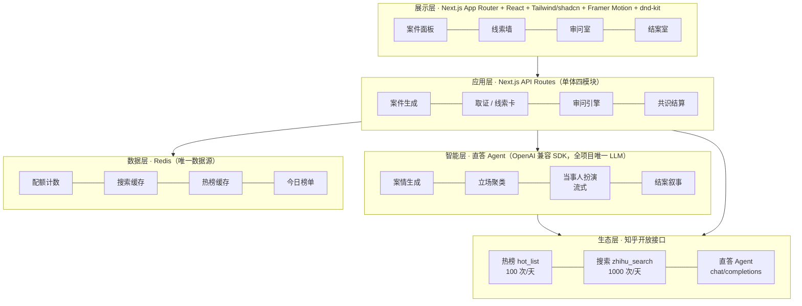
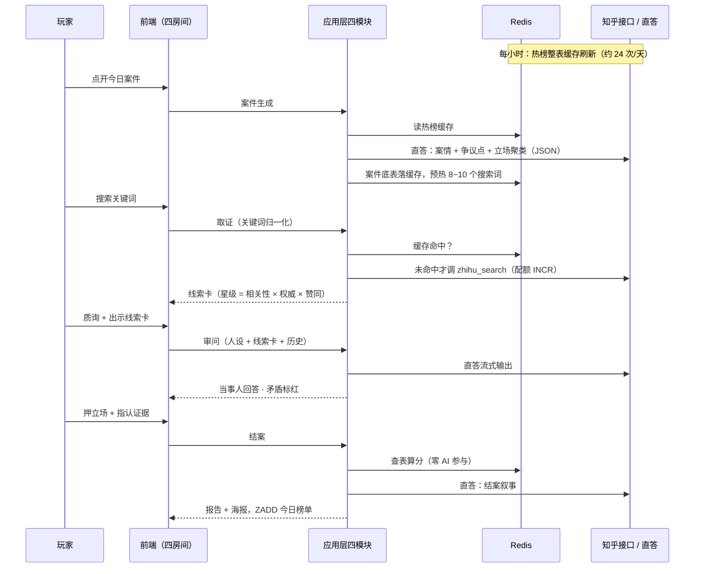

# 🔍 热搜疑云 · Trending Mystery

> **一款离开知乎生态就无法成立的叙事侦探游戏。**
> 每天，知乎热榜自动生成一个全新"案件"——用真实回答当线索，审问一个有据可依的 AI 当事人，最后对比"社区共识"结案。

**阅读动线**：01 是什么 → 02 怎么玩 → 03 怎么赢 → 04 技术方案 → 05 生态契合 → 06 黑客松执行 → 07 路线图

---

## 01 · 这是什么

**热搜疑云**是一款由知乎真实热点驱动的每日叙事侦探游戏：内容随热榜每日自动刷新，全球玩家同题破案，每一次取证、质询、结案都建立在知乎站内真实、鲜活的问答之上。

形态一句话：**每日一局的 Wordle × 取证质询的逆转裁判**。浏览器打开即玩，一局 15~30 分钟，结案生成分享海报；次日热榜刷新，全服换同一个新案子。没有下载，没有大世界，没有打怪升级。

> 创作理念：**把"吃瓜"升级为"破案"。**
> 热点天然具备悬疑叙事的全部要素——未知全貌、多方说法、真假难辨。我们不做内容搬运工，而是把知乎已有的内容资产（热榜、搜索、回答、赞同、创作者等级）重新组织成一套侦探玩法系统，让用户以"侦探"的身份重新走进每一个热点。

---

## 02 · 怎么玩：四个房间

界面是一间侦探事务所，四个房间正好对应四步玩法循环：

```
 1️⃣ 开局领案 ──► 2️⃣ 搜查取证 ──► 3️⃣ 审问对峙 ──► 4️⃣ 结案陈词
        ▲                                             │
        └───────────── 次日热榜，全新案件 ◄─────────────┘
```

以下跟随玩家小张走一局（虚构案件："某地地铁为何发生追尾事故？"）。

### 房间一 · 案件面板 —— 开局领案（看 · 约 2 分钟）

首页只有一张"今日案件"卡，点开进入案件面板：

```
┌────────────────────────────────────────────┐
│ 📁 案件编号 #20260910                       │
│ 问题：某地地铁为何发生追尾事故？              │
│                                            │
│ 案情简报（AI 依据高赞回答摘要撰写）：          │
│   昨夜 23 时许，两列车于 3 号线隧道内追尾，    │
│   官方通报指向"信号系统故障"，但多位自称      │
│   内部人士的爆料相互矛盾……                   │
│                                            │
│ 本次需查明 3 个争议点：                      │
│   ① 直接原因是什么？  ② 谁负主责？           │
│   ③ 爆料者的动机？                          │
│                                            │
│ 初始检索词：#信号系统 #调度记录    [开始搜查] │
└────────────────────────────────────────────┘
```

这一步等于考试前发卷子：结案要答哪几道题（争议点）现在就写明，搜资料有了靶子。

### 房间二 · 搜查取证 —— 搜 + 翻（约 8~15 分钟，分差主要在这里）

搜索框伪装成"档案检索系统"，背后就是知乎搜索。结果不列网页，而是一张张**线索卡**落进线索墙：

```
┌──────────────────────────────────────────────────────┐
│ 🔍 [ 地铁追尾 辟谣____________ ]  [检索]              │
│──────────────────────────────────────────────────────│
│ 疑点清单                  │ 🗂 线索墙（已收 6 张）     │
│  ① 直接原因               │ ┌─────────┐ ┌─────────┐ │
│  ② 谁负主责               │ │信号系统是│ │我同学是  │ │
│  ③ 爆料动机               │ │主因     │ │调度员…  │ │
│                          │ │⭐⭐⭐⭐⭐ │ │⭐⭐     │ │
│ 建议检索：                │ │👍 2.1万 │ │👍 342   │ │
│  #检修记录 #调度日志      │ │[收入档案袋]│[收入档案袋]│ │
│  #知情人士                │ └─────────┘ └─────────┘ │
└──────────────────────────────────────────────────────┘
```

星级与赞同数都是真实数据。拉开分差的三个操作习惯：

- **换着花样搜**：正着搜（"事故 原因"）、反着搜（"辟谣""质疑"）、换主体搜——只搜一组词的人只看到事件的一面；
- **每个立场都留牌**：哪怕不信"第三方施工责任"，也要留它的线索卡——结案时立场牌全摆出来，得先知道牌桌上有哪些注可押；
- **学会读赞同数**：2 万赞的五星技术帖和 300 赞的匿名小道消息摆在一面墙上，社区压哪边已经写在脸上。**高赞 × 高星 = 主流立场的指纹**（共识权重正是按赞同数加权的）。

### 房间三 · 审问室 —— 问 + 拖（约 5~10 分钟）

对话界面，对面是直答 Agent 扮演的"当晚值班调度员"。关键交互：**除了打字质询，还可以把线索卡"出示"给当事人**：

```
┌──────────────────────────────────────────────────────┐
│ 🕵 审问室 · 当事人：当晚值班调度员                     │
│──────────────────────────────────────────────────────│
│ 调度员：「那晚一切符合规程，为什么找我？」              │
│                                                      │
│ 你（出示 线索#3《信号系统三年未检修》⭐⭐⭐⭐⭐）：      │
│    这份检修记录，和你说的"一切正常"矛盾吧？             │
│                                                      │
│ 调度员：「……检修不归我们部门管，我只负责——」           │
│  ⚠ 系统标记：该回答与其先前说法冲突！                  │
│──────────────────────────────────────────────────────│
│ 💬 [ 输入质询…… ]   [🗂 出示线索卡]  [发送]           │
└──────────────────────────────────────────────────────┘
```

问泛问题它就打太极；出示对的卡、追问细节，它才露出破绽。**玩家喂进哪几张卡，决定 AI 能被撬开哪一面**——喂卡本身就是策略。

### 房间四 · 结案室 —— 押 + 拖（约 3 分钟）

争议点逐个结算：候选结论做成**立场牌**摆开，押一张，再把支持它的线索卡拖下去当证据：

```
┌──────────────────────────────────────────────────────┐
│ ⚖ 结案 · 争议点 ①：直接原因是什么？（1/3）            │
│                                                      │
│   ┌─────────┐  ┌─────────┐  ┌─────────┐             │
│   │ 设备老化 │  │ 调度违规 │  │ 第三方   │ ← 押一张    │
│   │  失修    │  │  操作    │  │ 施工责任 │             │
│   └────┬────┘  └─────────┘  └─────────┘             │
│        └ 指认证据：[线索#3 ⭐5] [线索#7 ⭐4]           │
│                                                      │
│ 结案陈词（可选）：[ 我认为……                    ]     │
│                                [ ⚖ 提交结案 ]        │
└──────────────────────────────────────────────────────┘
```

### 尾声 · 结案报告（约 1 分钟）

分数算完（见 §04 结案管线），立场牌**集体翻面**亮出社区权重——"设备老化"背后是 45% 的高赞主流，"第三方施工"只有 20%。评级、侦探风结案报告、分享海报（案件名 / 称号 / 得分 / 原问题链接）一次交付；海报发出去，朋友点进来玩的是同一个今天的案子。

---

## 03 · 怎么赢

胜利不是"猜中真相"，而是**高分结案**：

```
总分 = 共识吻合度 × 50% + 证据得分 × 35% + 陈词一致 × 15%（封顶）
```

| 评级 | 分数 | 称号 |
| --- | --- | --- |
| S | ≥ 90 | 神探 |
| A | 75 ~ 89 | 探长 |
| B | 60 ~ 74 | 警员 |
| C | < 60 | 实习生 |

取胜口诀：**广泛搜、读赞数、喂矛盾、押主流、只指认对口的五星卡。**

1. **开局先看考卷**：读争议点列表，知道结案答什么才知道搜什么；
2. **搜查攒情报**：多组关键词轮搜、每立场留牌、对比赞同数找主流指纹；
3. **审问验情报**：出示冲突线索卡看哪个说法站得住，问细节不问态度；
4. **结案押主流**：押赞同数权重最高的立场，只指认支持它的卡（指错倒扣），陈词自洽即可。

另有一条另类路线：坚持自定义结论、不押任何立场牌，拿不了高分，但解锁**"独狼侦探"**徽章——分数判你输，游戏尊重你。分数如实反映"你站在共识的哪一边"，这正是游戏的题眼。

---

## 04 · 技术方案

### 4.1 分层架构

一句话架构：**单体分层的 Next.js 应用 + 直答 Agent 智能层 + Redis 唯一数据层 + 知乎开放生态**——每层只做一件事，依赖单向向下。两人团队的诚实选择：单体分层而非微服务，**模块边界即未来服务边界**。



### 4.2 技术选型

| 层 | 选型 | 说明 |
| --- | --- | --- |
| 框架 | Next.js（App Router）+ TypeScript | 前后端一体单体，页面与 API 同仓同进程；不建独立后端、不上微服务 |
| UI / 动效 | Tailwind + shadcn/ui + Framer Motion + dnd-kit | 侦探风暗色主题；翻牌、飞卡、打字机流式输出；拖拽是核心交互动词 |
| LLM | 直答 Agent（唯一 LLM，OpenAI 兼容格式） | 案情生成、立场归类、审问人设、报告叙事全走它，原生 SDK 直连 |
| 数据 | 远程 Redis = 唯一数据层（Upstash 免费档或主办方实例） | 配额、缓存、可选榜单；**不引入第二个存储** |
| 身份 | localStorage 匿名侦探 ID | 账号体系是赛后 M3 的事 |
| 部署 | 一台服务器（Zeabur / 阿里云轻量）+ pm2 | 评委在国内，Vercel 默认域名访问不稳，不冒 demo 日翻车的险 |

> 框架决策规则：两人团队，前端主力熟悉 Vue 则换 Nuxt，其余取舍不变——熟练度优先于生态。

### 4.3 一局的技术动线

静态分层之外，系统真正的运行方式是一条从热榜到海报的流水线：



### 4.4 核心模块

| 模块 | 职责 | 关键设计 |
| --- | --- | --- |
| **案件生成** | 拉取当日热榜，筛选适合做案的问题，生成案情简报、争议点与立场牌底表 | 热点类型过滤器（排除敏感/纯时效话题）；同趟 LLM 调用一并完成共识聚类（见下） |
| **取证 / 线索卡引擎** | 代理玩家搜索，把真实回答封装为线索卡 | 可信度星级 = f(相关性分数, 权威等级, 赞同数) 加权换算，映射 1–5 星 |
| **审问引擎** | 驱动直答 Agent 扮演当事人 | 人设 prompt 控制"避重就轻"程度；玩家出示的线索卡决定可被撬开的信息面；矛盾检测标红前后冲突；对话历史随请求携带，服务端无状态 |
| **共识结算** | 管理立场牌底表与玩家押注，查表算分，产出结案报告与海报数据 | 全流程确定性打分，见下文结案管线 |
| **游戏前端** | 四个房间的沉浸式界面 | 线索墙收卡翻面、审问室出示线索卡、结案室押牌拖证据、翻牌亮权重动画、海报导出 |

### 4.5 结案管线（定稿设计）

**原则：AI 不当裁判。** 分数主体由查表与算术得出——同提交必同分、可排行、防雄辩操纵、防抄袭。LLM 只出现在"开局聚类"与"事后解说"两端。

诀窍：**争议点和候选立场在开局领案时就算好并锁死**（共识聚类的同趟 LLM 调用顺便产出），玩家和社区共识活在同一套标签空间里，比对变成查表而非临场判断。

**① 预计算共识分布**（开局锁定，对玩家隐藏权重）：

```json
{
  "issue": "事故的直接原因是什么？",
  "stances": [
    { "id": "s_a", "label": "设备老化失修", "clusterWeight": 0.45 },
    { "id": "s_b", "label": "调度违规操作", "clusterWeight": 0.35 },
    { "id": "s_c", "label": "第三方施工责任", "clusterWeight": 0.20 }
  ],
  "clueCards": [
    { "id": "c_03", "stars": 5, "supportsStance": "s_a" },
    { "id": "c_11", "stars": 2, "supportsStance": "s_c" }
  ]
}
```

**clusterWeight 由代码用真实点赞数计算，LLM 只做立场归类**——权重来自真实数据，不来自模型判断。玩家下注前基准已锁死，裁判不看选手脸色。

**② 玩家提交** = 押立场 + 指认证据（+ 可选陈词）：`{ issueId, stanceId, citedClueIds[] }`。

**③ 确定性打分**（纯代码，零 AI 参与）：

| 分项 | 权重 | 算法 |
| --- | --- | --- |
| 共识吻合度 | 50% | 所选立场 `clusterWeight ÷ 最主流立场 clusterWeight × 100` |
| 证据得分 | 35% | 指认线索卡中 `supportsStance` 命中所押立场的比例，按星级加权；指认不支持该立场的卡倒扣 |
| 陈词一致分 | 15%（封顶） | 唯一用 LLM 之处：判断自由文本是否与所选立场自洽、是否真引用线索内容，输出 0~1 系数 |

**④ LLM 只做解说**：分数算完后当解说员——立场牌翻面亮权重、指出玩家与共识的分歧、点评被采信的线索、写成侦探风结案报告与海报数据。

**边界情况**：自定义结论 → embedding 找最近簇按其权重给分，无匹配给"独狼侦探"徽章；陈词与高赞回答相似度 > 0.85 → "抄袭结案"，证据分减半；一边倒问题（单簇）→ 该争议点改为纯证据质量考核；零证据提交 → 证据分记零。

MVP 可砍掉③中的陈词一致分，只留"开局聚类 + 查表算分 + 报告叙事"，管线骨架不变。

---

## 05 · 为什么成立：设计理念与生态契合

### 四条创作思路

1. **热榜即案卷**。传统叙事游戏剧情写死且有限，知乎热榜每天都是新话题。案件由热榜问题自动包装生成——案情简报、疑点、待查关键词，内容生产成本趋近于零，新鲜度无限。
2. **真实回答即线索**。线索卡的可信度星级不由游戏随机分配，而由接口返回的相关性分数、创作者权威等级、赞同数换算而来。五星认证大佬和一星匿名小号，信谁——这是知乎社区每天都在发生的真实信息甄别行为，被原样搬进了游戏机制。
3. **AI 当事人**。直答 Agent 扮演当事人，回答内容锚定真实回答：有据可依，但问得不够细就避重就轻。这是一场推理博弈，不是剧本对话树。
4. **社区共识即真相基准**。玩家的对手不是出题人，而是该问题下高赞回答观点分布所代表的集体判断。

### 生态契合：每个机制都消费知乎原生资产

| 游戏机制 | 消费的知乎生态资产 | 离开知乎后 |
| --- | --- | --- |
| 每日案件 | 热榜的实时性与话题质量 | ❌ 无案可办 |
| 线索卡 + 可信度星级 | 站内搜索、真实回答、赞同数、创作者权威等级 | ❌ 无真实线索与信任体系 |
| AI 当事人 | 直答 Agent + 站内真实内容 grounding | ❌ 无据可依 |
| 结案基准 | 高赞回答的观点分布（社区共识） | ❌ 无真相基准 |
| 分享回流 | 结案海报携带问题链接，回流原生讨论 | ❌ 无传播闭环 |

**对社区的回馈**：玩家为破案主动深读回答、甄别信源——游戏把知乎"搜索—阅读—判断"的价值链包装成娱乐产品；结案海报携带问题链接，为原问题带来二次流量与新鲜讨论。侦探玩法与知乎用户理性、考据、爱推理的气质高度同构。

---

## 06 · 黑客松执行：简在工程，不简在体验

> **理念：用最短时间，做出讲台上那五分钟成立的东西。代码是一次性的，demo 效果大于工程质量。**
>
> 判定规则只有一条：**不出现在 demo 画面上的，选最简实现，够用就走；出现在 demo 画面上的，值得为它多熬两小时。**

### 时间投向

**简的（内功，够用即停）**：一个进程、一个 Redis、接口薄封装带缓存、配额一个 INCR、结案查表算分、localStorage 匿名 ID、一台服务器一个 pm2。

**不简的（皮肉，反复打磨）**：审问室流式打字与出示线索卡的交互、矛盾标红的瞬间、结案时立场牌集体翻面亮权重的动画、线索卡的档案质感、结案报告的侦探腔。**评委记住的是这三十秒。**

**结构性优势**：这个项目最重的部分——内容生产——由知乎生态白送。案件来自热榜、线索来自真实回答、当事人语料来自直答 Agent 的 grounding；传统团队最耗工时的剧情素材，我们一行代码不用写。两人的全部工时砸在"呈现"上，这正是两人团队能做出超出体量效果的原因。

### 接口与配额

| 环节 | 接口 | 配额 | 策略 |
| --- | --- | --- | --- |
| 开局领案 | 热榜 `GET /api/v1/content/hot_list` | 100/天 | 每小时整表缓存（约 24 次/天），案件生成读缓存；标题、热度分值、优质回答摘要直接用于简报，零额外搜索 |
| 搜查取证 | 搜索 `GET /api/v1/content/zhihu_search` | **1000/天（唯一硬约束）** | 按关键词计费、不按玩家计费：键为 `(caseId + 归一化关键词)` 全服共享；案件生成时预热 8~10 个建议词（约 10 次/案）；归一化（去空格/井号/统一大小写）；耗尽后只出缓存，未命中给"档案库检索受限"剧情化降级 |
| 审问对峙 | 直答 `POST /v1/chat/completions` | 未标注 | 人设 + 已出示线索卡随请求注入；控制历史长度 |
| 结案陈词 | 搜索缓存复用 + 直答 | — | 聚类素材来自缓存 |

### Redis 键（全部四个）

| 键 | 用途 |
| --- | --- |
| `quota:search:{日期}` / `quota:hotlist:{日期}` | 配额计数器：`INCR` + `EXPIRE 48h`；两台开发机与线上共用同一 `REDIS_URL`、同一本账——保命底线 |
| `cache:hotlist:{小时}` | 热榜整表缓存 |
| `cache:search:{caseId}:{归一化关键词}` | 搜索结果缓存，全服共享 |
| `board:case:{caseId}` | 今日神探榜（可选彩蛋）：ZSET 两个命令，顺手白送 |

### 明确砍掉的（及理由）

- **single-flight 锁**：现场几十人并发搜同一个未缓存词是伪问题，就算击穿多烧两次配额，无感；
- **档案袋 / 跨设备续玩**：一局十五分钟玩完就走，对局状态由客户端携带，服务端无状态；
- **持久化战绩 / 侦探档案**：demo 第二天这份数据没有意义；正式版要统计再加存储，读取点已收敛；
- **账号体系、微服务、PostgreSQL、第二个模型平台**：全部出局。

### 接口带来的增补机会

精选评论 → **"线人爆料"**副线索（审问也可出示，成本低侦探味足）；知乎故事 → **新手教学关**（避开灾难悲剧类话题，安全可控不烧配额）；全网搜索 → "外线情报"维度（M2/M3）；关注流 → 好友结案动态（M3，需授权链路）。

---

## 07 · 路线图

- [ ] **M0 · 技术验证**：跑通 热榜 → 案件 → 搜索 → 线索卡 最小链路；结案管线数据结构定稿；首日验证三件事——直答 Agent 角色扮演保真度（system prompt / 出示线索卡的响应）、结构化 JSON 输出稳定性（无 JSON mode 则容错解析）、搜索单次返回量实测
- [ ] **M1 · MVP**：四步玩法循环完整可玩（开局聚类 + 查表算分）
- [ ] **M2 · 体验打磨**：审问手感与矛盾检测、陈词一致分、结案报告 + 分享海报、线人爆料
- [ ] **M3 · 社区化**：账号体系、每日全球同题排行榜、侦探档案成长、外线情报、好友动态

---

## 08 · 项目结构

```
trending-mystery/
├── README.md
├── docs/                        # 产品计划说明书、设计稿、评审材料
└── src/
    ├── app/                     # 页面与路由（四个房间）
    │   └── api/
    │       ├── case/            # 案件生成
    │       ├── clue/            # 取证 / 线索卡引擎
    │       ├── interrogation/   # 审问引擎
    │       └── verdict/         # 共识结算（结案管线）
    └── lib/
        ├── zhihu/               # 知乎开放接口薄封装（热榜 / 搜索 / 直答）
        └── redis.ts             # 配额 / 缓存 / 每日榜单
```

---

## 📄 许可证

待定（团队内部评审阶段）。
